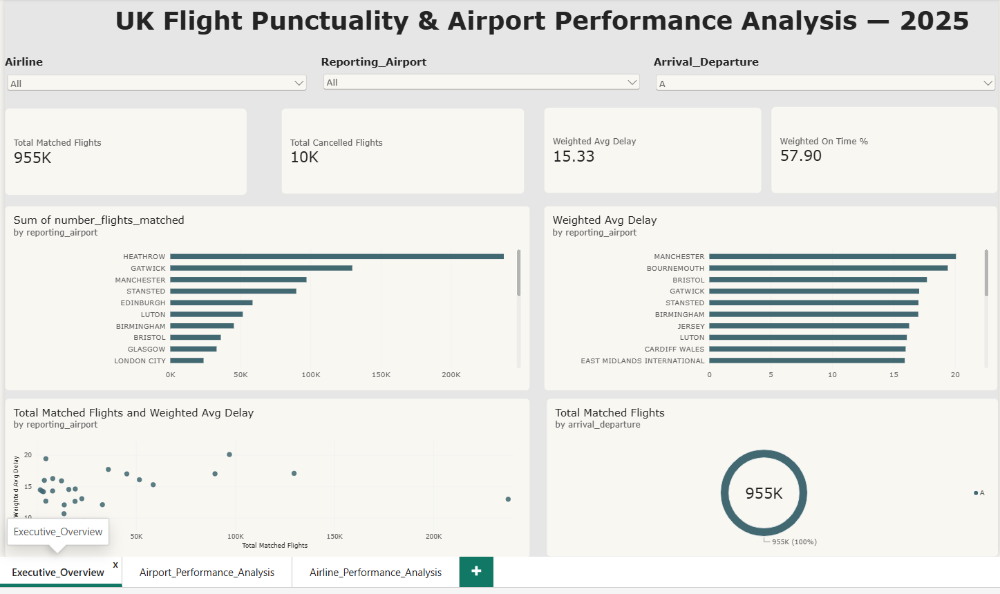
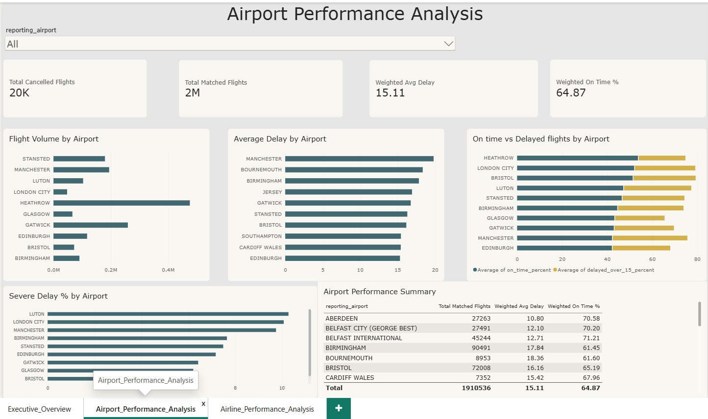
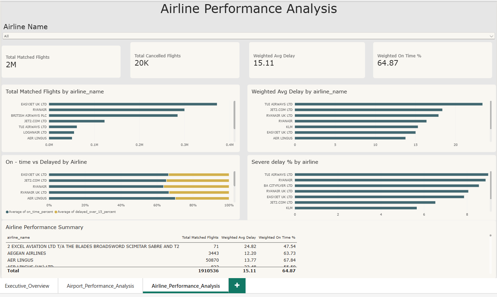

# UK CAA Flight Punctuality & Airport Performance Analysis — 2025

## Project Overview

I built this project to analyse UK flight punctuality using official 2025 data from the UK Civil Aviation Authority (CAA).

The project combines Python, MySQL and Power BI to explore flight volume, delays, cancellations, airport performance and airline performance.

The main goal was to take a real-world aviation dataset through the full analytics process:

Data Cleaning → SQL Analysis → DAX Measures → Power BI Dashboard

---

## Tools Used

- Python
- Pandas
- MySQL
- Power BI
- DAX
- Excel / CSV

---

## Dataset

Source: UK Civil Aviation Authority (CAA)

Dataset used:

**2025 Annual Punctuality Statistics – Full Analysis Arrival / Departure**

The original dataset contained more than 13,000 rows and included information such as:

- Reporting airport
- Airline
- Destination
- Arrival / departure
- Matched flights
- Cancelled flights
- Average delay
- Delay categories
- Previous-year performance

---

## Python Data Cleaning

I used Python and Pandas to inspect and prepare the dataset before analysis.

Some of the main steps included:

- Checking rows and columns
- Checking missing values
- Checking duplicate records
- Converting the run date into datetime format
- Investigating missing average delay values
- Creating additional analytical fields

I found that the missing values in `average_delay_mins` occurred when the number of matched flights was zero, so I kept these as missing values instead of replacing them with zero.

I also created new fields including:

- On-time percentage
- Flights delayed over 15 minutes
- Severe delay percentage
- Estimated delayed flights
- Estimated severe-delay flights

---

## SQL Analysis

After cleaning the data, I imported it into MySQL and used SQL to answer business questions such as:

- Which airports handled the highest number of matched flights?
- Which airlines handled the most flights?
- Which airports had the highest average delays?
- Which airlines had the highest delays?
- Which routes had the highest flight volume?
- Which airports contributed the most delayed flights?
- How did arrivals compare with departures?
- How did scheduled flights compare with charter flights?
- Which airports and airlines had high volume combined with poor punctuality?

I also used:

- GROUP BY
- HAVING
- CASE
- CTEs
- Window functions
- RANK()
- Weighted-average calculations

---

## Power BI Dashboard

I created a three-page interactive Power BI report.

### 1. Executive Overview

The Executive Overview provides a high-level view of the UK flight punctuality dataset.

It includes:

- Total matched flights
- Total cancelled flights
- Weighted average delay
- Weighted on-time percentage
- Airport flight-volume comparison
- Airport delay comparison
- Flight volume vs average delay
- Arrival / departure analysis
- Airline, airport and arrival/departure filters

---

### 2. Airport Performance Analysis

This page focuses on airport-level operational performance.

It includes:

- Matched flight volume by airport
- Weighted average delay by airport
- On-time vs delayed flights
- Severe delay percentage
- Airport performance summary
- Airport filtering

---

### 3. Airline Performance Analysis

This page compares airline punctuality and operational performance.

It includes:

- Matched flights by airline
- Weighted average delay
- On-time vs delayed flights
- Severe delay percentage
- Airline performance summary
- Interactive airline filtering

---

## DAX Measures

Some of the main Power BI measures I created were:

- Total Matched Flights
- Total Cancelled Flights
- Weighted Average Delay
- Weighted On-Time %

I used weighted calculations because different rows represent different numbers of flights. A simple average could therefore give a misleading picture of overall performance.

---

## Key Findings

The dashboard shows clear differences in punctuality between airports and airlines.

Some of the main observations from the analysis were:

- The dataset contains approximately **1.9 million matched flight movements**.
- The overall weighted average delay is approximately **15 minutes**.
- On-time performance varies significantly between airlines and airports.
- High flight volume does not automatically mean poor punctuality.
- Some airports and airlines have relatively high severe-delay percentages despite lower overall flight volumes.
